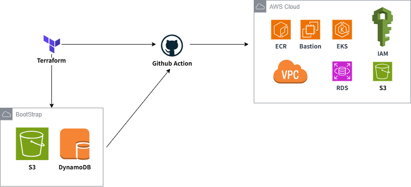

# 🚀 Terraform AWS Infrastructure (Production-Oriented IaC)

> **Terraform + AWS + GitHub Actions (OIDC)**  
> 운영 환경을 고려한 인프라 자동화 & GitOps 기반 배포 구조 설계 프로젝트

---

## 📌 Project Summary

이 프로젝트는 AWS 인프라를 Terraform으로 코드화하고,  
GitHub Actions + OIDC 기반으로 **안전하게 자동화된 인프라 운영 환경**을 구축한 프로젝트입니다.

✔ 단순 리소스 생성이 아닌  
👉 **"실제 운영 가능한 구조" 설계에 집중**

---

## 🧱 Core Features

- 🏗️ Terraform 기반 인프라 코드화 (IaC)
- 🌐 네트워크 계층 분리 (Public / Private App / DB)
- 🔐 OIDC 기반 GitHub Actions 인증 (No Access Key)
- 📦 Remote State (S3 + DynamoDB)
- ⚙️ 모듈 기반 구조 설계
- ☸️ EKS 기반 컨테이너 플랫폼 구축

---

## 🏗️ Architecture Overview

GitHub → GitHub Actions (OIDC)
↓
Terraform Plan / Apply
↓
AWS Infrastructure Provisioning
↓
VPC + EKS + RDS + ECR + S3

---

## 🧩 Architecture Layers

### 1️⃣ Bootstrap Layer
- Terraform Remote State 관리
- S3 (state 저장)
- DynamoDB (state lock)

---

### 2️⃣ Environment Layer
- `environments/dev`
- 실제 인프라 조합 영역
- 환경별 설정 분리

---

### 3️⃣ Module Layer
- 리소스를 역할 단위로 분리
- 재사용성과 유지보수성 확보

---

### 4️⃣ Delivery Layer
- GitHub Actions 기반 CI
- OIDC → IAM Role Assume 방식

---

## 📁 Directory Structure

.
├── .github/workflows # CI/CD (Terraform 실행)
├── bootstrap/backend # Remote State 초기 구성
├── environments/dev # 실제 인프라 구성
├── modules # 재사용 가능한 Terraform 모듈
│ ├── vpc
│ ├── eks
│ ├── rds
│ ├── ecr
│ ├── s3
│ ├── bastion
│ └── iam
└── README.md

---

## 🌐 Infrastructure Design

### 🧭 Network Segmentation

| Layer | 구성 |
|------|------|
| Public | Bastion, NAT Gateway |
| Private App | EKS Node |
| Private DB | RDS |

✔ 외부 노출 최소화  
✔ DB는 내부에서만 접근 가능

---

### ☸️ EKS

- Managed Node Group
- Private Subnet 배치
- OIDC 기반 확장 고려

---

### 🗄️ RDS

- Private Subnet
- Bastion + EKS만 접근 허용
- 백업 및 운영 옵션 확장 가능

---

### 📦 ECR

- 이미지 저장소
- Scan on Push
- Lifecycle 정책

---

### ☁️ S3

- 암호화 적용
- 업로드/조회 권한 분리

---

## 🔐 Security Design

- IAM Role 기반 접근 제어
- GitHub OIDC 인증 (Access Key 제거)
- Security Group 최소 권한
- Bastion 기반 내부 접근

---

## 🔄 CI/CD Workflow

### 📌 Trigger

- PR → `terraform plan`
- main push → `plan`
- manual → `apply`

---

### 📌 Flow

Code Push
↓
GitHub Actions
↓
Terraform Validate / Plan
↓
(Manual 승인)
↓
Terraform Apply

---

## ⭐ Key Design Decisions

### 1. 모듈화 구조
→ 유지보수성과 확장성 확보

### 2. 네트워크 계층 분리
→ 보안 + 운영 안정성 확보

### 3. Remote State 분리
→ 협업 가능 구조

### 4. OIDC 인증
→ **보안 수준 향상 (Access Key 제거)**

---

## 🚀 What This Project Demonstrates

이 레포는 다음 역량을 보여줍니다:

- Terraform 설계 능력 (Module / Environment 분리)
- AWS 인프라 아키텍처 설계
- GitHub Actions 기반 CI/CD 이해
- OIDC 기반 보안 인증 구조 설계
- 실무형 IaC 프로젝트 경험

---

## 🛠️ Tech Stack

- Terraform
- AWS (VPC, EKS, RDS, ECR, S3, IAM)
- GitHub Actions
- OIDC (IAM Federation)

---

## 🔮 Future Improvements

- Multi Environment (staging / prod)
- Helm + ArgoCD (GitOps 확장)
- Monitoring (Prometheus, Grafana)
- Secret 관리 체계 개선

---

## 💡 One-Line Summary (포트폴리오 핵심)

👉 **"Terraform과 OIDC 기반 GitHub Actions를 활용해 안전하고 자동화된 AWS 인프라 운영 환경을 구축한 프로젝트"**